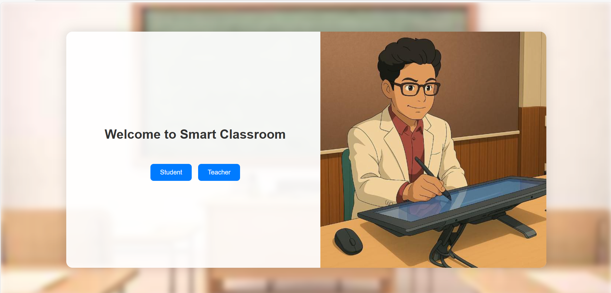
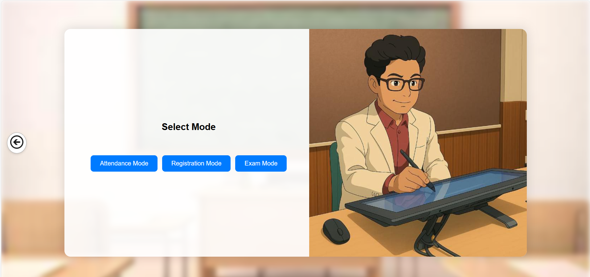
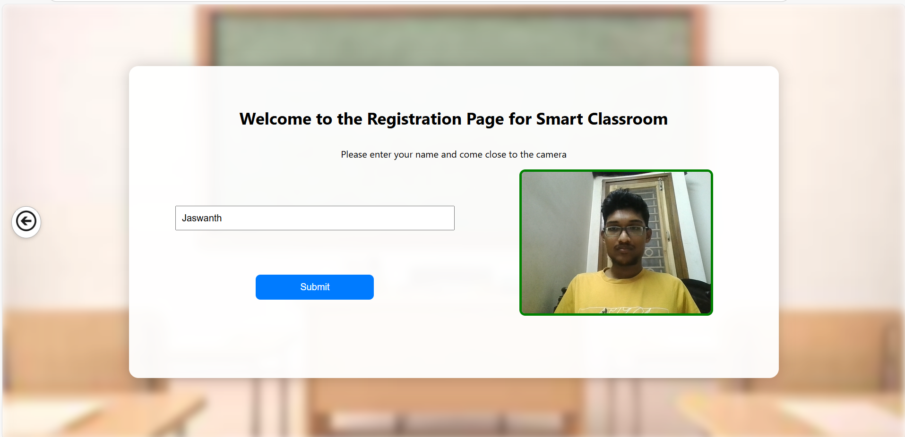
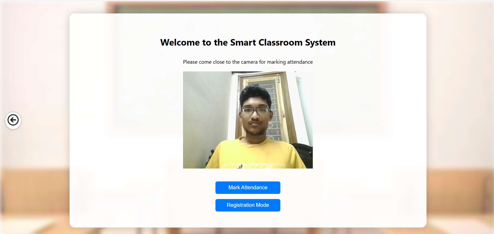
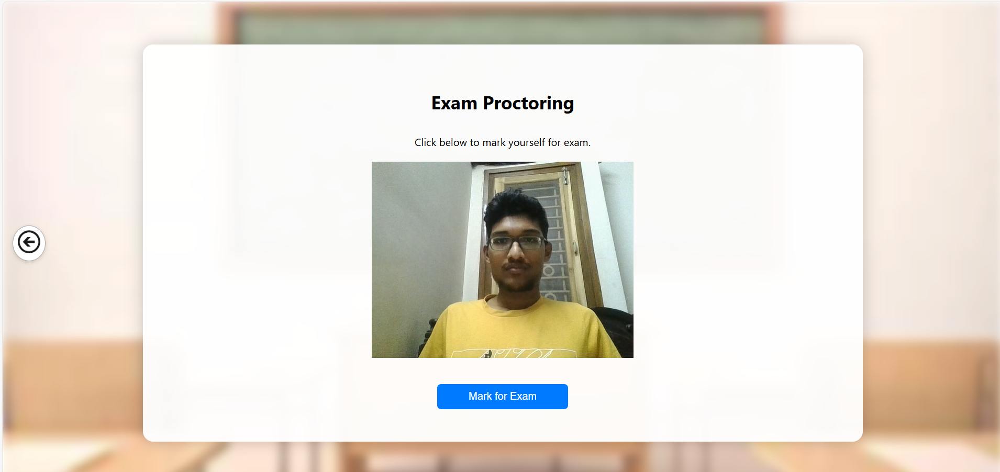

# 📚 Smart Classroom – Frontend

A React-based interface for a smart classroom system that supports student registration, attendance marking, and exam proctoring using webcam images.

---

## 🚀 Features

- 🎥 **Webcam-based student face capture**
- 🧑‍🎓 **Student** & 👨‍🏫 **Teacher** role selection
- 📝 **Registration** & **Attendance** modes
- ✅ **Exam proctoring** mode with eligibility check
- 🔙 **Back button** navigation on all pages (except home)
- 🔄 **Page transitions** handled using **React Router**

---

## 🔧 Setup Instructions

1. Install dependencies  
   ```bash
   npm install
   ```

2. Start the development server  
   ```bash
   npm start
   ```

   The app will be running at: [http://localhost:3000](http://localhost:3000)

---

## 📸 Screenshots

### 🏠 Home Page


### 🎛️ Mode Select Page (Student)


### 📝 Registration Page


### ✅ Attendance Page


### 🧪 Exam Mode Page


---

## 👨‍💻 Built With

- **ReactJS**
- **React Router**
- **React Webcam**
- **HTML5 + CSS3**
